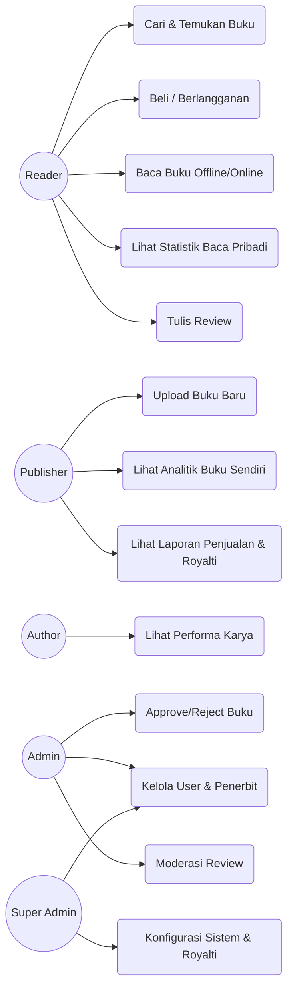
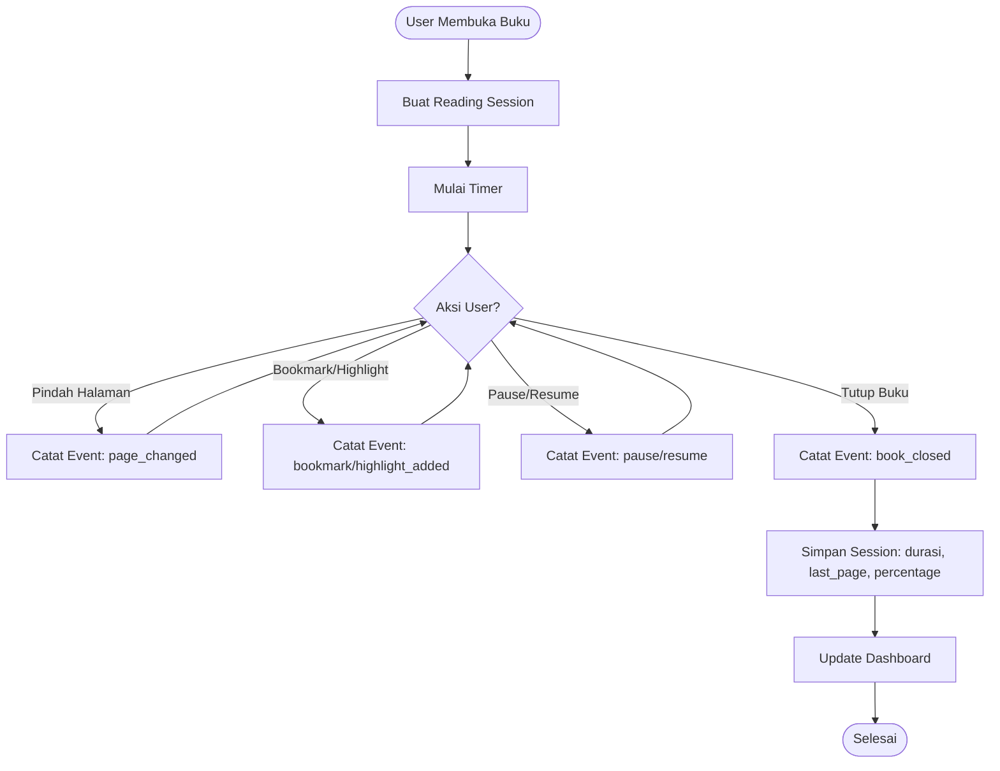
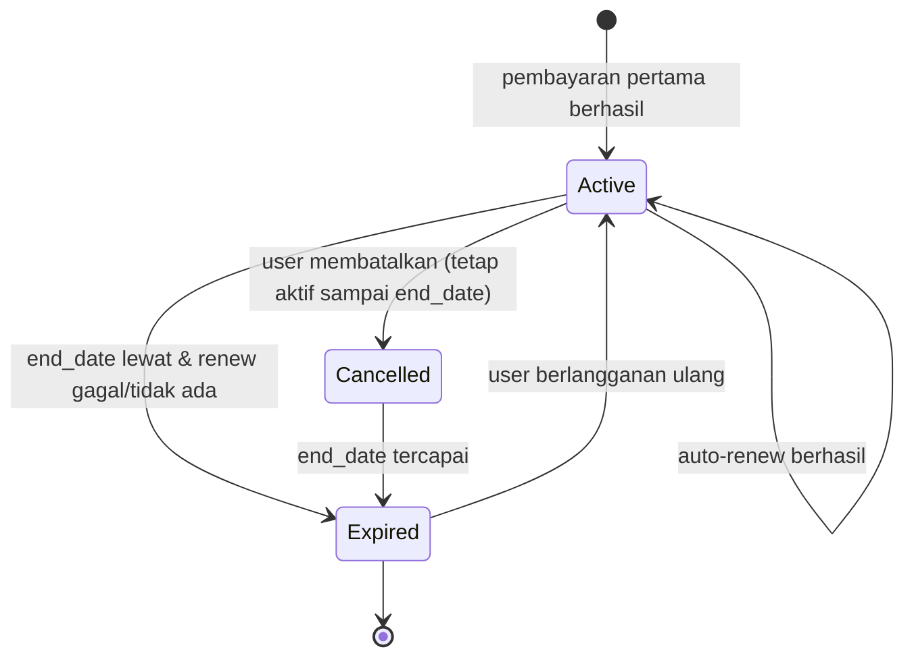
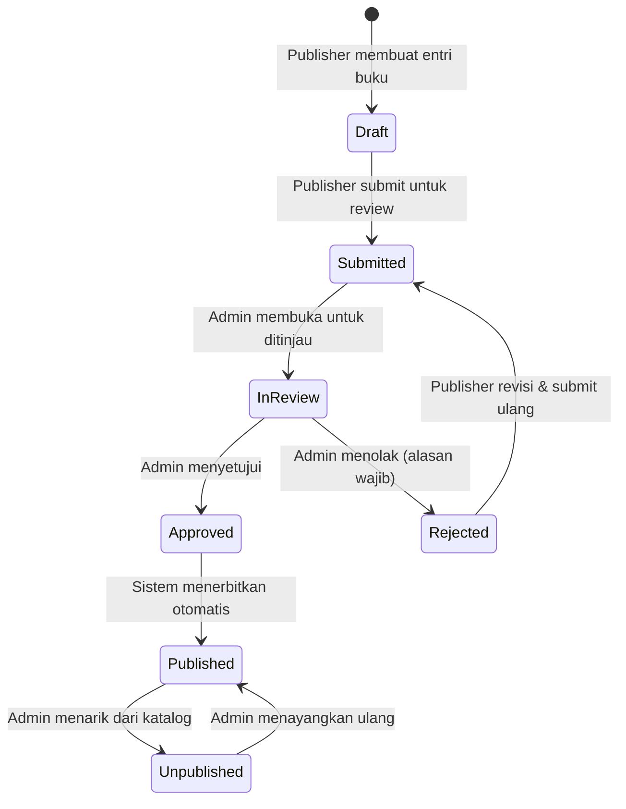
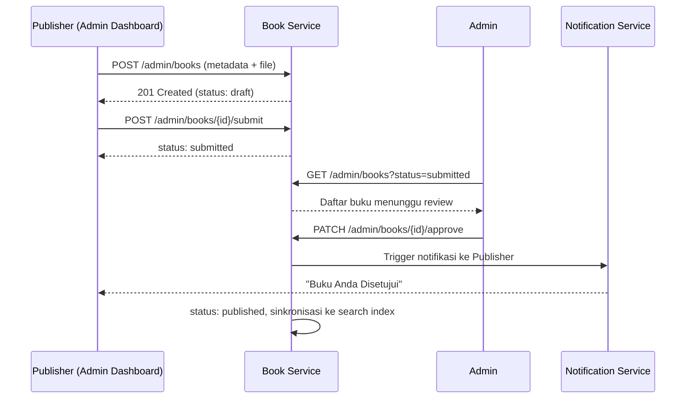
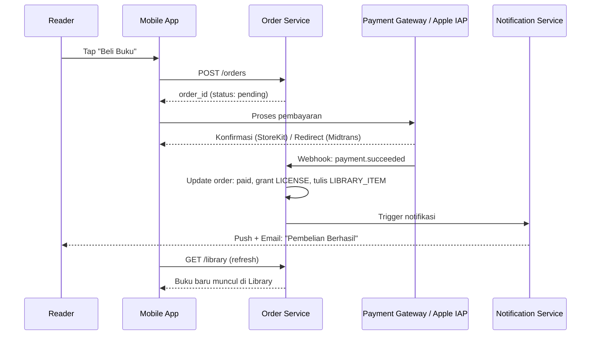
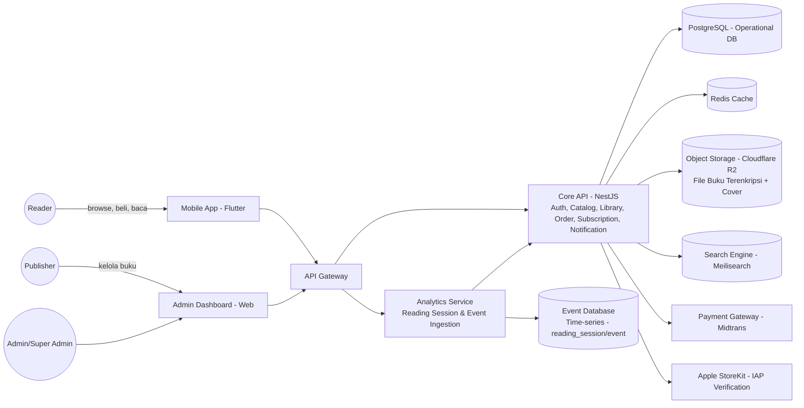
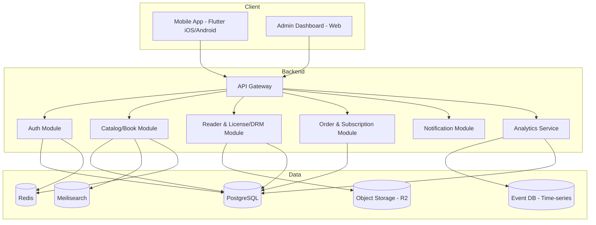
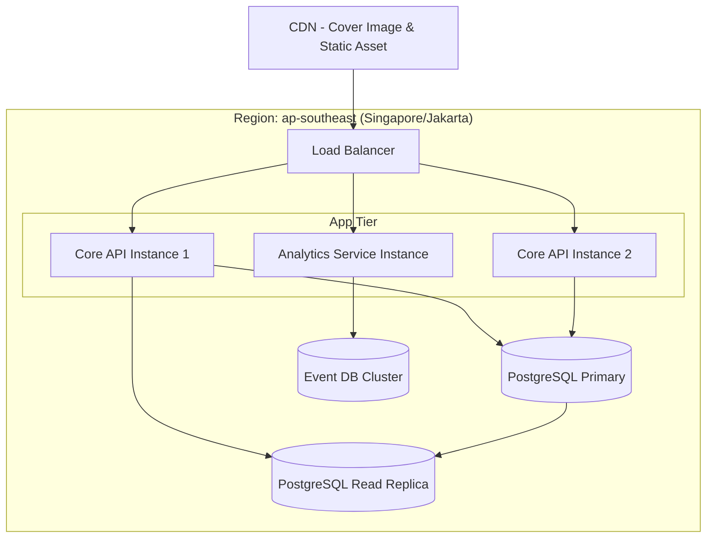
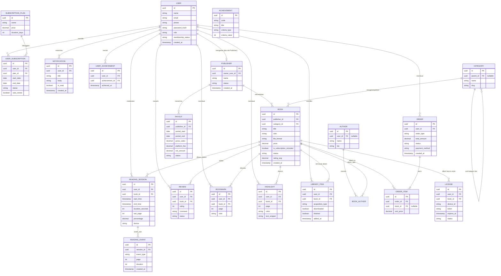

# Product Requirement Document (PRD)
# BacaNusantara — Platform Baca Buku Digital untuk Buku Lokal Indonesia

**Versi Dokumen:** 1.0
**Tanggal:** 20 Juli 2026
**Status:** Draft untuk review stakeholder
**Referensi Produk:** Gramedia Digital (model bisnis, fitur, dan alur pengguna)
**Referensi Desain:** Apple Human Interface Guidelines (bahasa visual, prinsip clarity–deference–depth)

> **Catatan nama produk:** "BacaNusantara" adalah *working title* yang diusulkan untuk kebutuhan dokumen ini, bukan nama final. Keputusan branding tetap berada di tangan stakeholder — lihat Section 31 (Appendix).

---

## 1. Executive Summary

BacaNusantara adalah aplikasi mobile (iOS & Android) untuk membaca dan membeli buku digital, dengan fokus khusus pada **buku-buku terbitan penerbit lokal Indonesia** — sebuah ekosistem yang saat ini kurang terlayani dibanding platform buku digital internasional. Produk ini mengambil referensi model bisnis dan struktur fitur dari **Gramedia Digital** (katalog, pembelian per buku, langganan, dan perpustakaan pribadi), tetapi dibedakan oleh dua hal utama:

1. **Arsitektur analitik yang menjadi fondasi sejak awal**, bukan tambahan — setiap interaksi baca (buka buku, pindah halaman, bookmark, highlight, selesai baca) tercatat sebagai *reading event* yang mengalir ke *reading history*, *engagement dashboard*, dan laporan bagi penerbit.
2. **Bahasa desain terinspirasi Apple Human Interface Guidelines** — clarity, deference, depth: tipografi sebagai elemen utama, whitespace generatif, motion halus, dan pengalaman membaca yang tidak terganggu oleh chrome UI yang berlebihan (mengikuti semangat Apple Books).

Selain aplikasi pembaca, dokumen ini juga mencakup **Admin Dashboard** (web back-office) untuk mengelola penerbit, penulis, kategori, approval buku, laporan penjualan/royalti, dan analitik pembacaan secara real-time — karena model bisnis melibatkan banyak penerbit lokal yang mengelola katalog mereka sendiri secara mandiri (self-service dengan approval).

Model bisnis adalah **kombinasi**: pembelian buku satuan (one-time purchase) dan langganan bulanan (unlimited access ke katalog yang ditandai "termasuk langganan") — meniru struktur GDP Poin/Unlimited pada Gramedia Digital.

---

## 2. Business Background

### Masalah Bisnis
Penerbit buku lokal Indonesia — baik penerbit besar maupun independen — belum memiliki platform digital yang secara khusus melayani ekosistem mereka dengan cara yang setara dengan yang dinikmati konten internasional di platform seperti Google Play Books atau Apple Books. Gramedia Digital sudah ada sebagai platform umum, tetapi brief ini mengarah pada produk **turunan yang lebih fokus** (niche: buku lokal) dan **lebih data-driven** — penerbit perlu tahu *bagaimana* pembaca benar-benar mengonsumsi buku mereka (durasi baca, titik berhenti, tingkat penyelesaian), bukan hanya angka penjualan.

### Peluang
- Penerbit lokal mendapat kanal distribusi digital dengan barrier masuk rendah (self-service upload).
- Pembaca mendapat pengalaman baca premium (ala Apple Books) dengan katalog yang relevan secara budaya dan bahasa.
- Data reading behavior menjadi aset bagi platform (rekomendasi, retensi) dan bagi penerbit (keputusan cetak ulang, marketing, akuisisi naskah baru).

### Model Bisnis
- **Pembelian satuan**: pengguna membeli hak baca permanen atas satu judul.
- **Langganan bulanan ("BacaNusantara Plus")**: akses unlimited ke buku-buku yang ditandai `is_subscription_included`; judul premium/baru bisa dikecualikan dan tetap harus dibeli terpisah — pola yang sama dengan GDP Unlimited di Gramedia Digital.
- Penerbit menerima **royalti** dari hasil penjualan dan proporsi akses langganan (lihat Section 12, Business Rules).

---

## 3. Goals & Objectives

| Tujuan | Deskripsi |
|---|---|
| G1 | Meluncurkan aplikasi mobile (iOS & Android) yang memungkinkan pembaca menemukan, membeli/berlangganan, dan membaca buku lokal Indonesia dengan pengalaman baca kelas premium. |
| G2 | Membangun arsitektur *reading analytics* end-to-end (event tracking → session → dashboard) sejak versi pertama, bukan retrofit. |
| G3 | Menyediakan kanal distribusi self-service bagi penerbit lokal dengan kontrol kualitas melalui alur approval Admin. |
| G4 | Melindungi hak cipta konten melalui DRM (watermark + enkripsi) sehingga penerbit percaya menaruh katalog mereka di platform. |
| G5 | Menghasilkan pendapatan berkelanjutan melalui kombinasi pembelian satuan dan langganan, dengan pembagian royalti yang transparan bagi penerbit. |

---

## 4. KPIs / Success Metrics

> Metrik di bawah ini tidak disebutkan eksplisit oleh stakeholder pada brief awal — ditandai sebagai **[ASSUMPTION]**, mengikuti standar industri aplikasi baca buku digital & marketplace konten.

- **[ASSUMPTION] Confidence: Medium** — DAU/MAU ratio (target awal ≥ 20%) sebagai indikator engagement harian terhadap total pengguna aktif bulanan.
- **[ASSUMPTION] Confidence: Medium** — Rata-rata reading time per pengguna aktif per minggu.
- **[ASSUMPTION] Confidence: Medium** — Reading streak retention (persentase pengguna dengan streak ≥ 7 hari).
- **[ASSUMPTION] Confidence: High** — Conversion rate dari "buku dilihat" ke "buku dibeli/dibaca via langganan" (funnel katalog → pembelian, metrik marketplace standar).
- **[ASSUMPTION] Confidence: Medium** — Jumlah penerbit aktif (submit ≥1 buku per bulan) sebagai indikator kesehatan sisi supply.
- **[ASSUMPTION] Confidence: Low** — Churn rate langganan bulanan (target awal < 8%/bulan) — angka spesifik perlu divalidasi stakeholder setelah data riil tersedia.

---

## 5. Scope

Disepakati bersama stakeholder pada sesi klarifikasi:

- Mobile App (Flutter) — **iOS & Android**, rilis bersamaan.
- Admin Dashboard (web back-office) — **full scope**, termasuk manajemen penerbit, buku, kategori, user, approval, laporan penjualan/royalti, dan analitik real-time.
- Lima role: **Reader, Publisher (Penerbit), Author (Penulis), Admin, Super Admin**.
- Monetisasi kombinasi: **pembelian satuan + langganan bulanan**.
- Alur konten: **Publisher upload mandiri → approval Admin sebelum publish**.
- **DRM wajib** (watermark + enkripsi) pada file PDF/EPUB.
- Autentikasi: **Email+Password, Phone/OTP, Social Login (Google & Apple)**.
- Reading analytics end-to-end: reading session, reading event, dashboard (reader-facing & admin/publisher-facing).
- Fitur inti pembaca: Home, Search, Book Detail, Reader (PDF/EPUB), Bookmark/Highlight/Notes, Offline Reading, Library, Review & Rating, Notifikasi, Profile/Reading Stats, Achievement.

## 6. Out of Scope

- Aplikasi web untuk membaca buku (mobile-only untuk versi ini; web reader masuk Future Roadmap).
- Audiobook / konten audio.
- Marketplace fisik (cetak, pengiriman buku fisik).
- Fitur sosial/komunitas (reading club, forum diskusi) — dicatat sebagai Future Roadmap.
- Program loyalitas/poin lintas-platform (di luar diskon langganan standar).
- Dukungan multi-bahasa selain Bahasa Indonesia pada versi awal (katalog & UI).
- Iklan sebagai model monetisasi (ditolak eksplisit pada klarifikasi bisnis).

---

## 7. Stakeholders

| Stakeholder | Kepentingan |
|---|---|
| Product Owner / Sponsor bisnis | Pemilik keputusan fitur & prioritas |
| Penerbit Lokal (Publisher) | Sumber katalog, penerima royalti, pengguna Admin Dashboard (role Publisher) |
| Penulis (Author) | Terhubung ke katalog buku, visibilitas kontribusi karya |
| Pembaca (Reader) | Pengguna akhir aplikasi mobile |
| Tim Operasional/Admin Platform | Menjaga kualitas konten via approval, menangani user & laporan |
| Tim Engineering | Implementasi teknis dari dokumen ini |

---

## 8. User Personas

### Persona 1 — Reader: "Dinda, 27, Content Creator"
Membaca 3–5 buku fiksi lokal per bulan lewat commute. Menghargai UI yang bersih dan tidak ramai, ingin melanjutkan bacaan tanpa hambatan lintas device, dan senang melihat statistik baca pribadinya (mirip Apple Fitness untuk kebiasaan baca).

### Persona 2 — Publisher: "Pak Herman, Editor di Penerbit Independen"
Mengelola katalog 40 judul, ingin proses upload cepat tanpa birokrasi berlebihan, dan butuh data nyata: buku mana yang benar-benar dibaca sampai selesai vs. hanya dibeli lalu ditinggalkan.

### Persona 3 — Author: "Sari, Penulis Novel"
Ingin melihat performa bukunya (jumlah pembaca, rating, ulasan) tanpa harus mengelola operasional penerbit.

### Persona 4 — Admin: "Tim Operasional Platform"
Menyaring kualitas konten yang masuk (approval), menangani komplain user, dan memantau kesehatan platform lewat dashboard.

### Persona 5 — Super Admin
Mengatur konfigurasi sistem, kategori master, kebijakan royalti, dan memiliki akses penuh lintas penerbit.

---

## 9. User Journey



**Journey ringkas — Reader (happy path):** Onboarding → Register/Login → Home (discovery) → Book Detail → Beli/Berlangganan → Reader (baca, progress otomatis tersimpan) → Library (lanjut baca kapan saja) → Reading Stats & Achievement.

**Journey ringkas — Publisher:** Login Admin Dashboard → Upload buku (metadata + file) → Status "Submitted" → menunggu review Admin → Approved → buku tayang di katalog → memantau analitik pembacaan & laporan royalti.

---

## 10. Functional Requirements

### 10.1 Registrasi & Login

**Purpose**: Memungkinkan pembaca membuat akun dan masuk melalui metode yang fleksibel sesuai kebiasaan pasar Indonesia.

**Business Value**: Metode login yang beragam (email, OTP, social) menurunkan friksi onboarding — makin cepat pengguna baru sampai ke katalog, makin tinggi konversi awal.

**Business Rules**:
- Satu email/nomor telepon hanya terhubung ke satu akun; social login yang emailnya sudah terdaftar otomatis ditautkan (account linking), bukan membuat akun duplikat.
- Registrasi via Phone wajib verifikasi OTP sebelum akun aktif.
- Password minimal 8 karakter, kombinasi huruf & angka.
- Role default akun baru dari mobile app selalu **Reader**; role Publisher/Author/Admin/Super Admin hanya dibuat/diundang lewat Admin Dashboard.

**Acceptance Criteria**:
| Given | When | Then |
|---|---|---|
| User baru mengisi email & password valid | Submit form registrasi | Akun dibuat berstatus aktif, user diarahkan ke Onboarding |
| User mendaftar dengan nomor HP | Submit registrasi | OTP dikirim, akun berstatus "pending verification" sampai OTP benar |
| User login dengan Google yang emailnya sudah terdaftar manual | Tap "Sign in with Google" | Akun yang sudah ada otomatis ditautkan, bukan akun baru dibuat |
| User salah password 5 kali berturut-turut | Percobaan login ke-6 | Akun dikunci sementara 15 menit, ditampilkan pesan jelas |

**Error Handling**: Pesan error spesifik per kasus (email sudah terdaftar, format salah, OTP kedaluwarsa) — tidak generik "terjadi kesalahan". Rate limiting pada endpoint OTP untuk mencegah abuse SMS gateway.

**Edge Cases**: Nomor HP sudah dipakai akun lama yang dihapus (soft-delete) → tetap dianggap terpakai selama retention period; user menutup app saat menunggu OTP → sesi registrasi tetap valid selama 10 menit; user mencoba social login tanpa email dari provider (jarang, tapi mungkin di Apple Sign In dengan "Hide My Email") → sistem menggunakan relay email dari Apple sebagai identifier unik.

**Permission**: Publik (unauthenticated) dapat mengakses endpoint registrasi/login.

**Dependencies**: SMS Gateway/OTP provider, OAuth provider (Google, Apple), Email service.

**API**:
| Method | Endpoint | Keterangan |
|---|---|---|
| POST | `/auth/register` | Registrasi email/password |
| POST | `/auth/otp/request` | Kirim OTP ke nomor HP |
| POST | `/auth/otp/verify` | Verifikasi OTP |
| POST | `/auth/login` | Login email/password |
| POST | `/auth/social/{provider}` | Login via Google/Apple |
| POST | `/auth/refresh` | Refresh JWT token |

**Database Impact**: Tabel `USER` (email, phone, password_hash, role, status), `AUTH_PROVIDER_LINK` (user_id, provider, provider_uid).

**UI Impact**: Splash, Onboarding, Login, Register, OTP Verification screen.

**QA Impact**: Unit test validasi form; integration test alur OTP dan account-linking; E2E untuk ketiga jalur login (email, phone, social).

**Analytics Event**: `user_registered` (method: email/phone/google/apple), `user_logged_in`.

**Security Consideration**: Password di-hash (bcrypt/argon2), JWT short-lived + refresh token rotation, OTP rate-limited & kedaluwarsa 5 menit, tidak pernah log OTP/password di sistem monitoring.

---

### 10.2 Home Feed & Discovery

**Purpose**: Titik masuk utama untuk menemukan buku — banner promosi, lanjutkan baca, populer, rilis baru, rekomendasi, kategori.

**Business Value**: Home adalah permukaan konversi tertinggi; personalisasi "Continue Reading" langsung terhubung ke Reading History sehingga retensi harian meningkat.

**Business Rules**: Section "Continue Reading" hanya menampilkan buku dengan `reading_session` progress > 0% dan < 100%, diurutkan berdasarkan `last_read_at` terbaru. "Recommendation" untuk versi awal berbasis kategori favorit pengguna (dari histori baca), bukan model ML kompleks — **[ASSUMPTION] Confidence: Medium**, karena stakeholder belum menentukan kebutuhan personalisasi tingkat lanjut.

**Acceptance Criteria**:
| Given | When | Then |
|---|---|---|
| User punya buku dengan progress 43% | Buka Home | Buku muncul di "Continue Reading" dengan progress bar & tombol lanjut |
| User belum pernah membaca buku apapun | Buka Home | Section "Continue Reading" disembunyikan, section "Popular" & "New Release" tetap tampil |

**Error Handling**: Jika salah satu section gagal dimuat (mis. Recommendation service timeout), section lain tetap tampil (graceful degradation), bukan seluruh Home gagal.

**Edge Cases**: Buku yang sedang dibaca kemudian di-unpublish oleh Admin → hilang dari "Continue Reading" tanpa error ke user.

**Permission**: Reader (authenticated); versi guest/browse-only **[ASSUMPTION] Confidence: Low** — tidak dibahas eksplisit, diasumsikan browsing katalog memerlukan login mengikuti pola Gramedia Digital.

**Dependencies**: Catalog Service, Reading Session data, Recommendation logic.

**API**:
| Method | Endpoint | Keterangan |
|---|---|---|
| GET | `/home/feed` | Mengembalikan seluruh section Home dalam satu payload |

**Database Impact**: Baca dari `BOOK`, `READING_SESSION`, `CATEGORY`.

**UI Impact**: Home screen (Banner, Continue Reading, Popular, New Release, Recommendation, Category).

**QA Impact**: Unit test logic sorting/filtering tiap section; E2E untuk skenario user baru vs. user lama.

**Analytics Event**: `home_viewed`, `home_section_book_tapped` (section_name, book_id, position).

**Security Consideration**: Tidak ada data sensitif; pastikan endpoint tidak membocorkan buku yang belum published ke user biasa.

---

### 10.3 Search & Filter Buku

**Purpose**: Membantu pembaca menemukan buku spesifik lewat judul, penulis, atau kategori, dengan filter dan riwayat pencarian.

**Business Rules**: Hanya buku berstatus `published` yang muncul di hasil pencarian. Recent Search disimpan maksimal 10 entri terakhir per user, bisa dihapus manual.

**Acceptance Criteria**:
| Given | When | Then |
|---|---|---|
| User mengetik "laskar" | Ketik di search bar | Hasil muncul real-time (debounced) termasuk "Laskar Pelangi" |
| User menerapkan filter kategori "Fiksi" + harga "Gratis dalam langganan" | Tap Apply Filter | Hasil hanya menampilkan buku sesuai kedua kriteria |
| Tidak ada hasil cocok | Search kata random | Tampilkan empty state dengan saran kategori populer |

**Error Handling**: Search engine timeout → fallback ke pencarian database sederhana (LIKE query) agar user tetap dapat hasil dasar.

**Edge Cases**: Typo umum (mis. "laskr") → fuzzy matching; pencarian dengan karakter khusus/SQL-like string harus di-sanitize.

**Permission**: Reader (authenticated).

**Dependencies**: Search Engine (Meilisearch — lihat Section 22), Catalog Service.

**API**:
| Method | Endpoint |
|---|---|
| GET | `/search?q={query}&category={id}&sort={x}` |
| GET | `/search/recent` |
| DELETE | `/search/recent/{id}` |

**Database Impact**: Index pencarian tersinkron dari `BOOK`; tabel `RECENT_SEARCH` (user_id, keyword, searched_at).

**UI Impact**: Search screen (search bar, filter sheet, recent search chips).

**QA Impact**: Unit test relevansi ranking dasar; integration test sinkronisasi index saat buku baru published; E2E filter kombinasi.

**Analytics Event**: `search_performed` (query, result_count), `search_filter_applied`.

**Security Consideration**: Input sanitization untuk mencegah injection ke search engine query.

---

### 10.4 Detail Buku

**Purpose**: Halaman informasi lengkap buku sebagai titik keputusan sebelum beli/baca.

**Business Rules**: Tombol aksi dinamis berdasarkan status kepemilikan: "Beli" (belum dimiliki & bukan bagian langganan aktif), "Baca" (sudah dimiliki/termasuk langganan aktif), "Berlangganan untuk Baca" (termasuk katalog langganan tapi user belum berlangganan).

**Acceptance Criteria**:
| Given | When | Then |
|---|---|---|
| Buku termasuk katalog langganan & user berlangganan aktif | Buka Book Detail | Tombol menampilkan "Baca" langsung |
| Buku tidak termasuk langganan & belum dibeli | Buka Book Detail | Tombol menampilkan "Beli — Rp {harga}" |

**Error Handling**: Jika data rating/review gagal dimuat, tetap tampilkan info inti buku (graceful degradation).

**Edge Cases**: Buku dihapus/unpublished saat user sedang membuka halamannya (jarang, race condition) → tampilkan pesan "buku tidak tersedia" saat aksi ditekan.

**Permission**: Reader (authenticated).

**Dependencies**: Catalog Service, Order/Subscription status, Review Service.

**API**:
| Method | Endpoint |
|---|---|
| GET | `/books/{id}` |
| GET | `/books/{id}/related` |

**Database Impact**: `BOOK`, `BOOK_AUTHOR`, `PUBLISHER`, `REVIEW` (agregat rating), `LIBRARY_ITEM`/`USER_SUBSCRIPTION` (untuk cek kepemilikan).

**UI Impact**: Book Detail screen (Synopsis, Author, Publisher, Rating, Reviews, Related Books, tombol aksi).

**QA Impact**: Unit test logic penentuan tombol aksi (matrix status kepemilikan); E2E dari Detail → Beli/Baca.

**Analytics Event**: `book_detail_viewed` (book_id, referrer_section).

**Security Consideration**: Endpoint tidak boleh mengekspos `file_url` asli buku sebelum status kepemilikan tervalidasi di server.

---

### 10.5 Reader Engine (Baca Buku + DRM)

**Purpose**: Mesin baca inti untuk file PDF/EPUB dengan proteksi DRM, menjadi jantung pengalaman produk dan sumber seluruh data reading analytics.

**Business Value**: Kualitas rendering & performa reader adalah faktor retensi #1 untuk aplikasi baca buku; DRM melindungi kepercayaan penerbit untuk menaruh katalog mereka.

**Business Rules**:
- File buku **tidak pernah** dikirim mentah ke client. Client meminta *license token* (lihat entitas `LICENSE`) yang membungkus akses terenkripsi ke konten, mengikuti pola **[ASSUMPTION] Confidence: Medium — Readium LCP untuk EPUB** (standar terbuka DRM ebook yang banyak dipakai penerbit dunia) **dan watermarking dinamis (nama/email/user_id tersamar) untuk PDF**, dipilih karena membangun DRM proprietary dari nol berisiko tinggi dan mahal untuk MVP.
- Satu lisensi maksimal aktif di **[ASSUMPTION] Confidence: Medium] 3 perangkat** bersamaan per user, untuk menyeimbangkan kenyamanan pengguna vs. pencegahan pembajakan.
- Progress baca (halaman terakhir, persentase) disimpan otomatis setiap kali user pindah halaman atau menutup buku, tersinkron lintas device.
- Reader mendukung penyesuaian font size dan tema (light/dark/sepia) — mengikuti bahasa desain Apple Books.

**Acceptance Criteria**:
| Given | When | Then |
|---|---|---|
| User memiliki hak baca buku (beli/langganan aktif) | Tap "Baca" | License token diambil, konten dirender, reading session baru dibuat |
| User membaca di HP lalu buka di tablet | Buka buku yang sama di device kedua | Progress terakhir tersinkron, user melanjutkan dari halaman terakhir |
| Langganan user berakhir sementara buku hanya tersedia via langganan | User membuka buku tsb setelah masa langganan habis | Akses ditolak, ditampilkan CTA "Perpanjang Langganan" |
| User mencapai device limit lisensi | Coba buka buku di device ke-4 | Ditampilkan pilihan untuk mencabut akses salah satu device lama |

**Error Handling**: Jika file gagal dirender (korup/format tidak didukung), tampilkan pesan jelas + opsi "Laporkan Masalah" yang mengirim tiket ke Admin, bukan crash aplikasi.

**Edge Cases**: User offline saat license token belum pernah diambil (belum pernah download) → akses ditolak dengan pesan perlu koneksi internet pertama kali; buku diunpublish oleh Admin setelah dibeli user → user tetap dapat mengakses buku yang sudah dimiliki (hak baca tidak dicabut retroaktif) — **[ASSUMPTION] Confidence: Medium**, kebijakan umum consumer protection untuk pembelian digital.

**Permission**: Reader yang memiliki hak baca aktif atas judul tersebut (purchased atau subscription aktif).

**Dependencies**: Book/Catalog Service, License/DRM Service, Reading Session Service.

**API**:
| Method | Endpoint |
|---|---|
| POST | `/books/{id}/license` | Terbitkan/ambil license token |
| GET | `/books/{id}/content` | Ambil konten terenkripsi (via license token) |
| PATCH | `/reading-sessions/{id}/progress` | Update progress baca |
| DELETE | `/licenses/{id}` | Cabut lisensi dari device tertentu |

**Database Impact**: `LICENSE` (user_id, book_id, device_id, token, expires_at, status), `READING_SESSION` (progress fields).

**UI Impact**: Reader screen (PDF/EPUB viewer, kontrol font/tema, progress bar).

**QA Impact**: Unit test validasi lisensi & device limit; integration test flow watermark & enkripsi; manual QA rendering lintas ukuran layar & format file; performance test waktu buka buku besar (>50MB).

**Analytics Event**: `book_opened`, `book_content_rendered_ms` (performance metric).

**Security Consideration**: Konten selalu dikirim terenkripsi in-transit (TLS) & at-rest (S3/R2 server-side encryption); watermark disematkan server-side, bukan client-side, agar tidak bisa dilewati dengan modifikasi app.

---

### 10.6 Bookmark, Highlight & Notes

**Purpose**: Alat bantu baca personal agar pengguna dapat menandai dan mencatat bagian penting buku.

**Business Rules**: Bookmark, highlight, dan notes bersifat privat per user (tidak terlihat user lain), tersinkron ke seluruh device milik user yang sama.

**Acceptance Criteria**:
| Given | When | Then |
|---|---|---|
| User menekan lama teks di reader | Pilih "Highlight" + warna | Highlight tersimpan & terlihat saat halaman dibuka kembali |
| User menambahkan bookmark di halaman 115 | Tap ikon bookmark | Bookmark muncul di daftar bookmark buku tsb |

**Error Handling**: Jika gagal sinkron ke server (offline), item tersimpan lokal dan disinkronkan otomatis saat online kembali (offline-first write).

**Edge Cases**: User highlight teks yang lalu dihapus dari revisi file buku (mis. penerbit reupload versi baru) → highlight tetap tersimpan dengan referensi halaman lama, ditandai "mungkin tidak akurat lagi" — **[ASSUMPTION] Confidence: Low**.

**Permission**: Reader, hanya untuk buku yang dimiliki.

**Dependencies**: Reader Engine.

**API**:
| Method | Endpoint |
|---|---|
| POST/GET/DELETE | `/books/{id}/bookmarks` |
| POST/GET/DELETE | `/books/{id}/highlights` |

**Database Impact**: `BOOKMARK`, `HIGHLIGHT` (user_id, book_id, page, color/note, created_at).

**UI Impact**: Reader toolbar, panel daftar bookmark/highlight per buku.

**QA Impact**: Unit test CRUD; integration test sinkronisasi offline-to-online.

**Analytics Event**: `bookmark_added`, `highlight_added`.

**Security Consideration**: Endpoint memverifikasi kepemilikan buku sebelum menyimpan (mencegah insert data untuk buku yang tidak dimiliki).

---

### 10.7 Reading Session & Event Tracking

**Purpose**: Fondasi analitik produk — merekam setiap sesi baca dan event granular di dalamnya sebagai sumber tunggal kebenaran untuk seluruh dashboard (reader, publisher, admin).

**Business Value**: Ini adalah fitur pembeda utama dibanding aplikasi baca buku "biasa" (per brief awal) — data ini memberi penerbit insight yang tidak tersedia di kanal penjualan buku fisik, dan memberi platform sinyal untuk rekomendasi & retensi.

**Business Rules**:
- Setiap kali buku dibuka, satu `READING_SESSION` baru dibuat dengan `session_id` unik.
- Setiap aksi (buka halaman, pindah halaman, bookmark, highlight, pause, resume, tutup) direkam sebagai satu baris `READING_EVENT` yang terhubung ke session tsb.
- Session ditutup otomatis (server-side timeout) jika tidak ada event baru selama **[ASSUMPTION] Confidence: Medium] 15 menit**, untuk mencegah sesi "menggantung" akibat app di-kill tanpa event close eksplisit.
- Data event dikirim client secara **batched** (bukan satu request per event) untuk efisiensi baterai/data — **[ASSUMPTION] Confidence: Medium**.

**Alur (Activity Diagram)**:



**Acceptance Criteria**:
| Given | When | Then |
|---|---|---|
| User membuka buku pukul 08:00, menutup pukul 08:35 | Session berakhir | `READING_SESSION` tersimpan dengan duration=35 menit, progress terupdate |
| User membaca 2 hari berturut-turut | Cek Reading Stats | Reading streak bertambah menjadi 2 hari |
| App di-kill paksa tanpa event `book_closed` | 15 menit tanpa event baru | Session ditutup otomatis oleh server dengan data terakhir yang tercatat |

**Error Handling**: Jika batch event gagal terkirim, client menyimpan di local queue dan retry dengan backoff, tidak menghilangkan data reading history.

**Edge Cases**: Jam device user tidak akurat (client clock skew) → server menggunakan server-side timestamp sebagai sumber utama untuk durasi, timestamp client hanya untuk urutan relatif event.

**Permission**: Reader (sistem, event dikirim otomatis oleh Reader Engine, bukan aksi manual).

**Dependencies**: Reader Engine (10.5), Event ingestion pipeline (lihat Section 22 System Architecture).

**API**:
| Method | Endpoint |
|---|---|
| POST | `/reading-sessions` | Buat session baru |
| POST | `/reading-sessions/{id}/events` | Kirim batch reading event |
| POST | `/reading-sessions/{id}/close` | Tutup session |

**Database Impact**: `READING_SESSION`, `READING_EVENT` — disimpan di **Event Database** terpisah (lihat Section 22) karena volume tulis tinggi.

**UI Impact**: Tidak ada UI langsung (background process); hasilnya tampil di Reading Stats (10.12) dan Admin Analytics (10.19).

**QA Impact**: Load test volume event tinggi (simulasi ribuan sesi konkuren); integration test auto-close session; unit test kalkulasi durasi & percentage.

**Analytics Event**: Ini *adalah* sistem analytics event itu sendiri — `book_opened`, `page_changed`, `bookmark_added`, `highlight_added`, `book_closed`, `book_finished`.

**Security Consideration**: Event tidak boleh berisi konten buku (hanya metadata halaman/durasi) untuk menghindari kebocoran data hak cipta lewat log analitik.

---

### 10.8 Offline Reading (Download Buku)

**Purpose**: Mengunduh buku untuk dibaca tanpa koneksi internet.

**Business Rules**: Buku yang diunduh tetap terenkripsi di storage lokal device (tidak pernah disimpan sebagai file mentah dapat dibaca aplikasi lain), license divalidasi ulang secara periodik saat online untuk mencegah penyalahgunaan setelah langganan berakhir — **[ASSUMPTION] Confidence: Medium] validasi ulang setiap 7 hari**, pola umum DRM offline (mis. Spotify offline mode).

**Acceptance Criteria**:
| Given | When | Then |
|---|---|---|
| User memiliki hak baca buku & online | Tap "Download" | Buku terunduh terenkripsi, muncul di Library > Downloaded |
| User berlangganan lalu langganan berakhir, buku sudah didownload | Buka buku offline setelah 7 hari tanpa online | Akses diblokir sampai user online untuk validasi ulang lisensi |

**Error Handling**: Gagal download (koneksi putus) → resume otomatis, bukan mulai dari 0.

**Edge Cases**: Storage device penuh → peringatan sebelum download dimulai.

**Permission**: Reader dengan hak baca aktif.

**Dependencies**: Reader Engine, License Service.

**API**:
| Method | Endpoint |
|---|---|
| POST | `/books/{id}/download` |
| DELETE | `/books/{id}/download` |

**Database Impact**: `LIBRARY_ITEM.downloaded` (boolean), tidak ada file disimpan di server per-device (file tetap satu sumber di Object Storage).

**UI Impact**: Tombol download di Book Detail/Library, indikator progress unduhan.

**QA Impact**: Manual QA pada kondisi jaringan buruk; test validasi ulang lisensi offline.

**Analytics Event**: `book_downloaded`.

**Security Consideration**: File terenkripsi di local storage sandbox aplikasi, kunci dekripsi terikat ke license token yang punya masa berlaku.

---

### 10.9 My Library

**Purpose**: Pusat koleksi pribadi pengguna — buku dibeli, diunduh, wishlist, dan selesai dibaca.

**Business Rules**: Tab "Purchased" menampilkan buku one-time purchase + buku yang diakses lewat langganan aktif (gabungan `LIBRARY_ITEM` dan `USER_SUBSCRIPTION` yang masih aktif); tab "Finished" otomatis terisi saat `READING_EVENT` type `finished` tercatat (progress ≥ 95% — **[ASSUMPTION] Confidence: Medium**, ambang umum karena banyak ebook reader tidak pernah mencapai tepat 100% akibat halaman kredit/lampiran).

**Acceptance Criteria**:
| Given | When | Then |
|---|---|---|
| User selesai baca buku hingga 96% | Tutup buku | Buku otomatis pindah ke tab "Finished" |
| User menambahkan buku ke wishlist | Tap ikon hati di Book Detail | Buku muncul di tab "Wishlist" |

**Error Handling**: Jika satu buku gagal dimuat metadatanya, buku lain di list tetap tampil normal.

**Edge Cases**: Buku di wishlist di-unpublish → tetap muncul di wishlist dengan label "Tidak Tersedia".

**Permission**: Reader (data milik sendiri).

**Dependencies**: Order/Purchase (10.10), Subscription (10.11), Reading Session (10.7).

**API**:
| Method | Endpoint |
|---|---|
| GET | `/library?tab={purchased/downloaded/wishlist/finished}` |
| POST/DELETE | `/wishlist/{book_id}` |

**Database Impact**: `LIBRARY_ITEM`, `WISHLIST`.

**UI Impact**: Library screen dengan 4 tab.

**QA Impact**: Unit test logic penggabungan purchased + subscription; E2E pindah tab otomatis saat buku selesai dibaca.

**Analytics Event**: `library_tab_viewed`, `wishlist_added`.

**Security Consideration**: Data library hanya dapat diakses oleh pemilik akun (scoped by authenticated user_id).

---

### 10.10 Beli Buku (One-time Purchase)

**Purpose**: Transaksi pembelian hak baca permanen atas satu judul buku.

**Business Value**: Sumber pendapatan utama untuk judul non-langganan/baru rilis, mengikuti pola Gramedia Digital yang tetap menjual sebagian judul secara satuan meski ada paket unlimited.

**Business Rules**:
- Harga final mengikuti `BOOK.price`, ditampilkan termasuk pajak jika berlaku — **[ASSUMPTION] Confidence: Low**, kebijakan pajak digital (PPN PMSE) perlu konfirmasi tim finance, dicatat sebagai Open Question.
- **[ASSUMPTION] Confidence: High — Platform iOS wajib menggunakan Apple In-App Purchase (IAP)** untuk pembelian konten digital sesuai App Store Review Guideline 3.1.1, sementara Android dapat menggunakan payment gateway pihak ketiga (Midtrans/Xendit) sesuai kebijakan Google Play untuk konten baca (lihat Section 29, Risk Analysis).
- Refund diperbolehkan dalam **24 jam setelah pembelian dan reading_time = 0** (buku belum pernah dibuka) — **[ASSUMPTION] Confidence: Medium**, kebijakan umum untuk barang digital agar tidak disalahgunakan sebagai "pinjam gratis".
- Royalti penerbit dihitung dari harga jual dikurangi platform fee (lihat Section 12, Business Rules).

**Acceptance Criteria**:
| Given | When | Then |
|---|---|---|
| User di Android memilih metode QRIS via Midtrans | Konfirmasi pembayaran | Order berstatus "pending" → webhook Midtrans mengubah ke "paid" → buku masuk Library |
| User di iOS membeli buku | Konfirmasi pembelian | StoreKit memproses IAP → backend memvalidasi receipt → buku masuk Library |
| Pembayaran gagal/timeout | Cek status order | Order berstatus "failed", user dapat mencoba ulang tanpa dikenakan biaya |
| User request refund dalam 24 jam, belum pernah membuka buku | Ajukan refund | Refund disetujui otomatis, akses buku dicabut |

**Error Handling**: Webhook payment gateway yang gagal diproses (network) di-retry dengan idempotency key agar tidak dobel-charge atau dobel-grant akses.

**Edge Cases**: User membeli buku yang sama dua kali karena double-tap → dicegah di level API dengan idempotency check per user+book+pending order; harga buku berubah setelah item ada di "intent to buy" tapi sebelum bayar → harga final mengikuti harga saat transaksi dieksekusi, bukan saat dilihat.

**Permission**: Reader (authenticated).

**Dependencies**: Payment Gateway (Midtrans — lihat Section 22), Apple StoreKit (iOS), License Service (grant akses setelah paid).

**API**:
| Method | Endpoint |
|---|---|
| POST | `/orders` | Buat order pembelian |
| POST | `/orders/{id}/payment-webhook` | Callback dari payment gateway |
| POST | `/orders/{id}/verify-iap-receipt` | Verifikasi receipt Apple IAP |
| POST | `/orders/{id}/refund` | Ajukan refund |

**Database Impact**: `ORDER`, `ORDER_ITEM`, `LIBRARY_ITEM` (ditulis setelah order paid), `LICENSE`.

**UI Impact**: Book Detail (tombol beli), Payment method sheet, Order confirmation, Riwayat transaksi di Profile.

**QA Impact**: Integration test webhook payment (success/fail/timeout); test double-purchase prevention; manual QA IAP flow di sandbox App Store.

**Analytics Event**: `purchase_initiated`, `purchase_completed` (book_id, price, payment_method), `purchase_failed`, `refund_requested`.

**Security Consideration**: Webhook harus diverifikasi signature dari payment gateway; IAP receipt diverifikasi server-side ke Apple, tidak pernah percaya klaim "sukses" dari client saja.

---

### 10.11 Langganan (Subscription)

**Purpose**: Akses unlimited ke katalog yang ditandai termasuk langganan, dengan pembayaran berulang bulanan.

**Business Rules**:
- Satu `SUBSCRIPTION_PLAN` aktif untuk versi awal ("BacaNusantara Plus", bulanan) — **[ASSUMPTION] Confidence: Medium**, paket lain (tahunan, keluarga) masuk Future Roadmap.
- Auto-renew default aktif; user dapat membatalkan kapan pun, akses tetap berlaku sampai `end_date` periode berjalan (tidak langsung dicabut).
- Sama seperti pembelian satuan, **iOS wajib via Apple IAP subscription**, Android via payment gateway dengan recurring billing/VA reminder — **[ASSUMPTION] Confidence: High**, alasan sama dengan 10.10.

**Diagram Lifecycle (State):**



**Acceptance Criteria**:
| Given | When | Then |
|---|---|---|
| User berlangganan pertama kali | Bayar sukses | `USER_SUBSCRIPTION` status Active, akses ke seluruh katalog subscription-included |
| User membatalkan di tengah periode | Tap "Batalkan Langganan" | Status jadi Cancelled, akses tetap berjalan sampai end_date, tidak ada auto-renew berikutnya |
| Auto-renew gagal (kartu ditolak) | Tanggal renewal tiba | Status jadi Expired, user diberi notifikasi untuk update pembayaran |

**Error Handling**: Kegagalan renewal memberi grace period **[ASSUMPTION] Confidence: Low] 3 hari** sebelum akses benar-benar dicabut, agar tidak langsung memutus akses karena kegagalan sementara.

**Edge Cases**: User punya buku yang sudah dibeli satuan sebelum berlangganan → tidak ada refund otomatis, kedua entitlement (purchased & subscription) tetap berjalan independen.

**Permission**: Reader (authenticated).

**Dependencies**: Payment Gateway / Apple StoreKit (recurring), Library (10.9).

**API**:
| Method | Endpoint |
|---|---|
| POST | `/subscriptions` | Mulai langganan |
| POST | `/subscriptions/{id}/cancel` | Batalkan auto-renew |
| GET | `/subscriptions/current` | Cek status langganan aktif |

**Database Impact**: `SUBSCRIPTION_PLAN`, `USER_SUBSCRIPTION`.

**UI Impact**: Halaman paket langganan, status langganan di Profile.

**QA Impact**: Integration test siklus renewal & cancellation; test grace period.

**Analytics Event**: `subscription_started`, `subscription_cancelled`, `subscription_renewed`, `subscription_expired`.

**Security Consideration**: Status langganan divalidasi server-side setiap kali akses buku diminta, tidak disimpan/dipercaya dari cache client saja.

---

### 10.12 Reading Stats & Achievement (Reader-facing)

**Purpose**: Menyajikan kembali data Reading Session/Event ke pengguna dalam bentuk statistik personal dan pencapaian (gamifikasi) yang memotivasi kebiasaan membaca.

**Business Rules**: Reading streak bertambah jika user memiliki minimal satu `READING_EVENT` pada hari kalender tsb (zona waktu WIB — **[ASSUMPTION] Confidence: Medium**, karena localization di luar scope multi-timezone); streak reset ke 0 jika ada hari kosong. Achievement dipicu otomatis oleh kondisi tertentu (mis. "7 Hari Beruntun", "10 Buku Selesai") dan dicatat sekali (tidak berulang untuk kondisi yang sama).

**Acceptance Criteria**:
| Given | When | Then |
|---|---|---|
| User membaca setiap hari selama 7 hari | Cek Profile | Reading Streak menunjukkan 7 hari, Achievement "7 Hari Beruntun" ter-unlock |
| User melewatkan satu hari tanpa membaca | Cek Profile keesokan harinya | Streak reset ke 0 |

**Error Handling**: Jika kalkulasi achievement gagal (job async), statistik dasar (reading time, buku selesai) tetap tampil normal — achievement tidak memblokir tampilan stats.

**Edge Cases**: User pindah zona waktu (traveling) → dihitung berdasarkan waktu server WIB, berpotensi menyebabkan anomali kecil — dicatat sebagai keterbatasan yang diketahui, bukan bug.

**Permission**: Reader (data milik sendiri).

**Dependencies**: Reading Session & Event (10.7).

**API**:
| Method | Endpoint |
|---|---|
| GET | `/profile/reading-stats` | Reading time (hari ini/minggu ini), buku selesai/sedang dibaca, avg session, streak, total halaman, heatmap |
| GET | `/profile/achievements` |

**Database Impact**: Baca agregat dari `READING_SESSION`/`READING_EVENT` (Event Database); `ACHIEVEMENT`, `USER_ACHIEVEMENT`.

**UI Impact**: Profile > Reading Stats (kartu metrik + heatmap), Achievement gallery.

**QA Impact**: Unit test kalkulasi streak & achievement trigger; test batas hari (tengah malam WIB).

**Analytics Event**: `achievement_unlocked` (achievement_code).

**Security Consideration**: Data agregat hanya untuk user itu sendiri; tidak ada leaderboard publik lintas user pada versi ini (privasi).

---

### 10.13 Review & Rating

**Purpose**: Memberi pembaca lain sinyal kualitas buku dan memberi penerbit umpan balik langsung.

**Business Rules**: Hanya user yang memiliki hak baca (purchased/subscription) atas buku tsb yang dapat menulis review — **[ASSUMPTION] Confidence: High**, standar umum "verified reader review" untuk mencegah review palsu. Satu user satu review per buku (bisa diedit, bukan duplikat). Review dapat dilaporkan (report) oleh user lain dan masuk antrean moderasi Admin.

**Acceptance Criteria**:
| Given | When | Then |
|---|---|---|
| User memiliki hak baca buku | Beri rating 5 bintang + komentar | Review tersimpan, rating rata-rata buku terupdate |
| User belum memiliki hak baca buku | Buka Book Detail | Tombol "Tulis Review" tidak tersedia |
| Review dilaporkan 3x oleh user berbeda | Sistem mendeteksi threshold | Review otomatis disembunyikan sementara, masuk antrean moderasi Admin |

**Error Handling**: Kegagalan submit review menampilkan draft tersimpan lokal agar user tidak kehilangan tulisan.

**Edge Cases**: User yang me-refund buku setelah menulis review → review otomatis diarsipkan (tidak tampil publik) — **[ASSUMPTION] Confidence: Low**.

**Permission**: Reader dengan hak baca (create/edit review sendiri); Admin (moderasi).

**Dependencies**: Order/Subscription entitlement check.

**API**:
| Method | Endpoint |
|---|---|
| POST/PUT | `/books/{id}/reviews` |
| POST | `/reviews/{id}/report` |
| PATCH | `/admin/reviews/{id}/moderate` |

**Database Impact**: `REVIEW` (user_id, book_id, rating, comment, status).

**UI Impact**: Section Review di Book Detail, form tulis review.

**QA Impact**: Unit test entitlement check; integration test alur report → moderasi.

**Analytics Event**: `review_submitted`, `review_reported`.

**Security Consideration**: Sanitasi input komentar (XSS); rate limit submit review untuk cegah spam.

---

### 10.14 Notifikasi

**Purpose**: Menginformasikan pengguna tentang status transaksi, rilis buku baru, pengingat baca, dan status approval (untuk Publisher).

**Business Rules**: Notifikasi dikirim via **push (FCM)** sebagai kanal utama; kanal email digunakan untuk hal transaksional (invoice, konfirmasi pembayaran) — **[ASSUMPTION] Confidence: Medium**, brief awal hanya menyebut FCM, email ditambahkan sebagai praktik umum untuk bukti transaksi.

**Acceptance Criteria**:
| Given | When | Then |
|---|---|---|
| Pembayaran user berhasil | Order status paid | Push notification "Pembelian Berhasil" terkirim + email invoice |
| Publisher submit buku | Admin approve buku tsb | Publisher menerima push+in-app notification "Buku Anda Disetujui" |

**Error Handling**: Kegagalan pengiriman push tidak memblokir proses bisnis utama (mis. pembelian tetap sukses walau notifikasi gagal terkirim); notifikasi tetap tercatat sebagai in-app notification meski push gagal.

**Edge Cases**: User menonaktifkan push permission OS → in-app notification list tetap terisi sebagai fallback.

**Permission**: Sistem (server-triggered); user mengatur preferensi di Settings.

**Dependencies**: FCM, Email service, Order/Subscription/Book Approval events.

**API**:
| Method | Endpoint |
|---|---|
| GET | `/notifications` |
| PATCH | `/notifications/{id}/read` |
| PATCH | `/notifications/settings` |

**Database Impact**: `NOTIFICATION` (user_id, title, body, type, is_read).

**UI Impact**: Notification screen, badge counter, Settings > Notification preferences.

**QA Impact**: Integration test trigger dari tiap event bisnis; test opt-out preference dihormati.

**Analytics Event**: `notification_sent`, `notification_opened`.

**Security Consideration**: Notifikasi tidak boleh berisi data sensitif penuh (mis. nomor kartu) di payload push.

---

### 10.15 Upload Buku & Approval Workflow

**Purpose**: Memungkinkan Publisher menambahkan buku baru secara mandiri dengan kontrol kualitas oleh Admin sebelum tayang ke pembaca.

**Business Value**: Ini adalah mekanisme akuisisi konten utama platform — kecepatan & kejelasan proses approval langsung memengaruhi seberapa banyak penerbit lokal mau bergabung.

**Business Rules**:
- Publisher hanya dapat mengelola buku miliknya sendiri (scoped by `publisher_id`).
- File wajib format PDF atau EPUB, ukuran maksimal **[ASSUMPTION] Confidence: Low] 200MB** (bisa disesuaikan kebijakan storage).
- Admin dapat approve, reject (dengan alasan wajib diisi), atau meminta revisi.
- Buku yang di-reject dapat diedit & disubmit ulang oleh Publisher (tidak perlu membuat entri baru).

**Diagram Lifecycle (State):**



**Sequence Diagram — Alur Approval:**



**Acceptance Criteria**:
| Given | When | Then |
|---|---|---|
| Publisher melengkapi metadata + upload file valid | Tap "Submit for Review" | Status buku menjadi "Submitted", masuk antrean Admin |
| Admin menolak dengan alasan "Cover tidak sesuai standar" | Tap "Reject" | Publisher menerima notifikasi berisi alasan, buku kembali ke status Submitted setelah direvisi |
| Admin menyetujui buku | Tap "Approve" | Buku otomatis published, muncul di katalog & search dalam waktu singkat |

**Error Handling**: Upload file gagal di tengah jalan → resume upload, bukan mulai ulang dari 0; validasi format/ukuran dilakukan sebelum upload penuh dimulai (client-side pre-check + server-side re-validation).

**Edge Cases**: Publisher menghapus buku yang sudah published & sudah dibeli beberapa user → buku di-unpublish (bukan hard delete) agar pembeli lama tetap punya akses (konsisten dengan aturan di 10.5).

**Permission**: Publisher (create/edit/submit buku sendiri); Admin & Super Admin (approve/reject/unpublish lintas penerbit).

**Dependencies**: Object Storage (file), DRM/License Service (proses watermark saat approve), Search index.

**API**:
| Method | Endpoint |
|---|---|
| POST | `/admin/books` | Buat draft buku |
| PATCH | `/admin/books/{id}` | Edit metadata/file |
| POST | `/admin/books/{id}/submit` | Submit untuk review |
| PATCH | `/admin/books/{id}/approve` | Approve (Admin) |
| PATCH | `/admin/books/{id}/reject` | Reject (Admin, wajib alasan) |
| PATCH | `/admin/books/{id}/unpublish` | Tarik dari katalog |

**Database Impact**: `BOOK` (status, review_note), `BOOK_AUTHOR`.

**UI Impact**: Admin Dashboard — Book Form (Publisher), Book Review Queue (Admin).

**QA Impact**: Unit test state transition (tidak bisa approve dari status Draft langsung, dsb.); integration test upload besar; E2E full cycle draft→published.

**Analytics Event**: `book_submitted`, `book_approved`, `book_rejected`.

**Security Consideration**: File upload divalidasi tipe MIME asli (bukan hanya ekstensi) untuk mencegah upload file berbahaya; hanya Admin/Super Admin yang bisa approve, tidak bisa dilakukan Publisher sendiri (segregation of duty).

---

### 10.16 Manajemen Kategori (Admin)

**Purpose**: Mengelola taksonomi kategori/subkategori buku yang dipakai di Search, Home, dan filter.

**Business Rules**: Kategori dapat berjenjang (parent-child), maksimal 2 level — **[ASSUMPTION] Confidence: Medium**. Kategori yang masih memiliki buku aktif tidak dapat dihapus, hanya dinonaktifkan.

**Acceptance Criteria**:
| Given | When | Then |
|---|---|---|
| Super Admin membuat kategori "Fiksi > Fiksi Sejarah" | Simpan | Subkategori tersedia untuk dipilih Publisher saat upload buku |
| Kategori memiliki 20 buku aktif | Admin coba hapus kategori tsb | Sistem menolak, menyarankan nonaktifkan saja |

**Error Handling**: Perubahan nama kategori tidak memutus relasi ke buku yang sudah ada (referensi via ID, bukan nama).

**Edge Cases**: Menghapus subkategori yang punya buku → buku otomatis naik ke kategori induk, bukan menjadi tanpa kategori.

**Permission**: Super Admin (create/delete), Admin (edit).

**Dependencies**: Catalog Service.

**API**:
| Method | Endpoint |
|---|---|
| GET/POST/PATCH/DELETE | `/admin/categories` |

**Database Impact**: `CATEGORY` (id, name, slug, parent_id).

**UI Impact**: Admin Dashboard — Category Management.

**QA Impact**: Unit test validasi hierarki 2 level; test proteksi hapus kategori berisi buku.

**Analytics Event**: Tidak ada event reader-facing; dicatat di audit log (Section 25).

**Security Consideration**: Hanya role Admin/Super Admin.

---

### 10.17 Manajemen User & Publisher (Admin)

**Purpose**: Mengelola akun Reader, Publisher, Author, dan staf Admin — termasuk aktivasi/suspensi akun penerbit.

**Business Rules**: Akun Publisher baru diverifikasi manual oleh Admin (status `pending` → `active`) sebelum dapat mengupload buku — **[ASSUMPTION] Confidence: Medium**, praktik umum marketplace multi-vendor untuk mencegah penerbit fiktif.

**Acceptance Criteria**:
| Given | When | Then |
|---|---|---|
| Penerbit baru mendaftar via Admin Dashboard | Admin memverifikasi dokumen legalitas | Status Publisher jadi Active, dapat login & upload buku |
| Admin men-suspend akun Publisher yang melanggar aturan | Konfirmasi suspend | Buku-buku Publisher tsb otomatis unpublished, Publisher tidak bisa login |

**Error Handling**: Suspensi tidak menghapus data historis (order, royalti) — hanya membatasi akses baru.

**Edge Cases**: Publisher yang di-suspend memiliki langganan reader yang sedang membaca buku mereka → akses reader yang sudah membeli/berlangganan tetap berjalan (konsisten dengan 10.5).

**Permission**: Admin & Super Admin.

**Dependencies**: -

**API**:
| Method | Endpoint |
|---|---|
| GET | `/admin/users` |
| PATCH | `/admin/users/{id}/status` |
| PATCH | `/admin/publishers/{id}/verify` |

**Database Impact**: `USER`, `PUBLISHER` (status field).

**UI Impact**: Admin Dashboard — User & Publisher Management.

**QA Impact**: Unit test cascading effect suspend Publisher → unpublish buku; audit log test.

**Analytics Event**: Dicatat di audit log.

**Security Consideration**: Semua aksi suspend/verify tercatat di audit log dengan actor_id (siapa Admin yang melakukan).

---

### 10.18 Sales Report & Payout Royalti (Admin)

**Purpose**: Memberikan penerbit dan Admin visibilitas atas penjualan dan menghitung royalti yang harus dibayarkan.

**Business Rules**: Royalti dihitung **70% untuk Publisher, 30% platform fee** dari pembelian satuan — **[ASSUMPTION] Confidence: Medium**, mengikuti standar umum platform buku digital (mis. rasio yang lazim dipakai Apple Books/Google Play Books). Untuk pendapatan langganan, alokasi ke penerbit dihitung proporsional terhadap **total menit baca** buku mereka dibanding total menit baca seluruh platform pada periode tsb — **[ASSUMPTION] Confidence: Medium**, model "streaming-share" yang selaras dengan filosofi reading-analytics-first produk ini (mirip model royalti Spotify berbasis play-time, bukan sekadar jumlah unduhan).

**Acceptance Criteria**:
| Given | When | Then |
|---|---|---|
| Periode bulan berjalan berakhir | Sistem menjalankan kalkulasi payout | `PAYOUT` per Publisher dibuat berisi gross sales, share langganan (berbasis reading time), platform fee, net amount |
| Publisher membuka Sales Report | Pilih rentang tanggal | Menampilkan breakdown penjualan satuan vs. kontribusi langganan per buku |

**Error Handling**: Jika kalkulasi payout gagal untuk satu penerbit (data anomali), proses tidak menghentikan kalkulasi penerbit lain — dicatat sebagai exception untuk ditinjau manual.

**Edge Cases**: Buku pindah antar kategori/penerbit di tengah periode → payout dihitung berdasarkan snapshot kepemilikan pada waktu transaksi/reading event terjadi, bukan status terkini.

**Permission**: Publisher (lihat laporan miliknya sendiri), Admin & Super Admin (lihat semua + eksekusi payout).

**Dependencies**: Order (10.10), Subscription (10.11), Reading Session (10.7) untuk basis alokasi share langganan.

**API**:
| Method | Endpoint |
|---|---|
| GET | `/admin/publishers/{id}/sales-report` |
| GET | `/admin/payouts` |
| POST | `/admin/payouts/{id}/mark-paid` |

**Database Impact**: `PAYOUT` (publisher_id, period_start, period_end, gross_sales, platform_fee, net_amount, status).

**UI Impact**: Admin Dashboard — Sales Report, Payout Management; Publisher-side Sales Report view.

**QA Impact**: Unit test formula alokasi royalti langganan; integration test job kalkulasi periodik; reconciliation test (total payout = total pendapatan - platform fee).

**Analytics Event**: Dicatat di audit log; tidak ada reader-facing event.

**Security Consideration**: Data finansial hanya terlihat oleh Publisher yang bersangkutan (row-level scoping) dan role Admin/Super Admin.

---

### 10.19 Reading Analytics Dashboard (Admin & Publisher)

**Purpose**: Menyajikan seluruh data Reading Session/Event dalam bentuk dashboard real-time bagi Admin (platform-wide) dan Publisher (khusus buku miliknya) — inti nilai jual produk ini dibanding platform baca buku generik.

**Business Rules**: Publisher hanya melihat analitik buku miliknya (row-level security by `publisher_id`); Admin/Super Admin melihat agregat seluruh platform. Dashboard mengambil data dari Event Database dengan **[ASSUMPTION] Confidence: Medium] latensi maksimal 5 menit** ("near real-time", bukan streaming milidetik, cukup untuk kebutuhan bisnis dan lebih murah secara infrastruktur).

**Acceptance Criteria**:
| Given | When | Then |
|---|---|---|
| Publisher membuka dashboard bukunya | Pilih rentang 7 hari terakhir | Menampilkan reading time, completion rate, drop-off point (halaman rata-rata user berhenti) |
| Admin membuka dashboard platform | Filter per kategori | Menampilkan agregat reading time, buku terpopuler, retention/streak distribution |

**Error Handling**: Jika salah satu widget dashboard gagal memuat, widget lain tetap tampil (dashboard tidak all-or-nothing).

**Edge Cases**: Buku baru published belum punya cukup data (< 10 sesi) → tampilkan pesan "data belum cukup" alih-alih grafik kosong yang membingungkan.

**Permission**: Publisher (scoped ke buku sendiri), Admin & Super Admin (platform-wide).

**Dependencies**: Reading Session & Event (10.7).

**API**:
| Method | Endpoint |
|---|---|
| GET | `/admin/analytics/platform-overview` |
| GET | `/admin/analytics/publishers/{id}` |
| GET | `/admin/analytics/books/{id}` |

**Database Impact**: Baca (read-only, agregat) dari Event Database.

**UI Impact**: Admin Dashboard — Analytics module (grafik reading time, heatmap, completion funnel, drop-off chart).

**QA Impact**: Test row-level scoping (Publisher A tidak bisa melihat data Publisher B); load test query agregat pada volume data besar.

**Analytics Event**: N/A (ini adalah consumer dari event, bukan producer).

**Security Consideration**: Row-level access control ketat — kebocoran data antar-penerbit adalah risiko kepercayaan bisnis yang serius.

---

## 11. Non-Functional Requirements

| Kategori | Requirement |
|---|---|
| Performa | Waktu buka buku (dari tap "Baca" hingga halaman pertama render) < 2 detik pada koneksi 4G rata-rata. Home feed load < 1.5 detik. **[ASSUMPTION] Confidence: Medium** |
| Skalabilitas | Arsitektur mendukung pertumbuhan event reading (write-heavy) secara independen dari beban transaksi lain — lihat pemisahan Event Database di Section 22. **[ASSUMPTION] Confidence: Medium — target awal ~50.000–100.000 pengguna terdaftar & puluhan penerbit di tahun pertama**, berdasarkan konteks "banyak penerbit lokal" pada brief, perlu divalidasi dengan target bisnis riil. |
| Ketersediaan | Target uptime 99.5% (best-effort, bukan SLA formal berbayar) untuk versi awal. **[ASSUMPTION] Confidence: Low** |
| Offline Mode | Reader mendukung baca offline penuh untuk buku yang sudah diunduh (lihat 10.8); fitur lain (Search, Beli) memerlukan koneksi. |
| Keamanan | Lihat Section 24 secara detail. |
| Kepatuhan Data | Best-effort terhadap prinsip UU PDP (data minimization, hak hapus akun) tanpa sertifikasi formal pada fase ini — sesuai keputusan stakeholder. |
| Aksesibilitas | Mengikuti prinsip aksesibilitas Apple HIG: Dynamic Type (ukuran teks dapat diperbesar), kontras warna memadai (WCAG AA sebagai baseline), dukungan VoiceOver/TalkBack pada elemen interaktif utama. **[ASSUMPTION] Confidence: Medium** |
| SEO | Tidak relevan — produk adalah aplikasi mobile, bukan web publik. |
| Device Support | Reader engine diuji pada rentang device menengah-bawah (RAM ≥ 3GB) mengingat sebagian target pasar Indonesia menggunakan device kelas menengah. **[ASSUMPTION] Confidence: Medium** |

---

## 12. Business Rules

Ringkasan lintas-fitur (detail per fitur ada di Section 10):

1. **Kepemilikan tidak dicabut retroaktif** — buku yang sudah dibeli/pernah diakses via langganan tetap dapat dibaca user meski buku kemudian di-unpublish atau penerbitnya disuspend.
2. **Royalti**: 70% Publisher / 30% platform fee untuk pembelian satuan; alokasi share langganan berbasis proporsi reading time. **[ASSUMPTION] Confidence: Medium**
3. **Approval wajib** — tidak ada buku yang tayang ke katalog tanpa melalui status `Approved` oleh Admin/Super Admin.
4. **DRM wajib** pada seluruh file buku, tanpa pengecualian, sesuai keputusan stakeholder.
5. **Refund** hanya dalam 24 jam & reading_time = 0. **[ASSUMPTION] Confidence: Medium**
6. **Segregation of duty**: Publisher tidak dapat menyetujui bukunya sendiri; hanya Admin/Super Admin.
7. **Row-level data isolation**: Publisher hanya melihat data (analitik, sales report) miliknya sendiri.
8. **Platform payment differentiation**: iOS wajib Apple IAP untuk konten digital; Android via payment gateway pihak ketiga. **[ASSUMPTION] Confidence: High**

---

## 13. Acceptance Criteria (Consolidated View)

Kriteria penerimaan lengkap per fitur telah dituliskan inline di masing-masing subsection Section 10 (format Given/When/Then). Ringkasan cakupan:

| Modul | Jumlah Skenario AC Terdefinisi |
|---|---|
| Auth & Login | 4 |
| Discovery (Home/Search/Detail) | 7 |
| Reader & DRM | 4 |
| Bookmark/Highlight | 2 |
| Reading Session & Event | 3 |
| Offline Reading | 2 |
| Library | 2 |
| Purchase | 4 |
| Subscription | 3 |
| Reading Stats & Achievement | 2 |
| Review & Rating | 3 |
| Notifikasi | 2 |
| Book Upload & Approval | 3 |
| Kategori | 2 |
| User & Publisher Management | 2 |
| Sales Report & Payout | 2 |
| Analytics Dashboard | 2 |

---

## 14. Permission Matrix

| Fitur / Aksi | Super Admin | Admin | Publisher | Author | Reader |
|---|:---:|:---:|:---:|:---:|:---:|
| Registrasi & Login | ➖ | ➖ | ➖ | ➖ | ✅ |
| Beli / Berlangganan Buku | ➖ | ➖ | ➖ | ➖ | ✅ |
| Baca Buku (Reader Engine) | ➖ | ➖ | ➖ | ➖ | ✅ |
| Tulis Review | ➖ | ➖ | ➖ | ➖ | ✅ |
| Upload / Edit Buku Sendiri | ✅ | ✅ | ✅ | ➖ | ➖ |
| Approve / Reject Buku | ✅ | ✅ | ➖ | ➖ | ➖ |
| Unpublish Buku (lintas penerbit) | ✅ | ✅ | ➖ | ➖ | ➖ |
| Lihat Analitik Buku Sendiri | ✅ | ✅ | ✅ | ✅ (read-only performa karya) | ➖ |
| Lihat Analitik Platform-wide | ✅ | ✅ | ➖ | ➖ | ➖ |
| Kelola Kategori | ✅ | ✅ (edit saja) | ➖ | ➖ | ➖ |
| Kelola User & Verifikasi Publisher | ✅ | ✅ | ➖ | ➖ | ➖ |
| Lihat Sales Report Sendiri | ➖ | ➖ | ✅ | ✅ (read-only royalti karya) | ➖ |
| Eksekusi Payout | ✅ | ✅ | ➖ | ➖ | ➖ |
| Moderasi Review | ✅ | ✅ | ➖ | ➖ | ➖ |
| Konfigurasi Sistem (royalti %, dsb.) | ✅ | ➖ | ➖ | ➖ | ➖ |

---

## 15. UX Guidelines

Mengikuti tiga prinsip inti **Apple Human Interface Guidelines** sebagai bahasa desain produk:

- **Clarity** — Tipografi adalah elemen desain utama, bukan dekorasi berlebihan. Setiap layar punya satu tujuan utama yang jelas (mis. Reader fokus 100% pada konten, chrome UI disembunyikan otomatis saat membaca — pola yang sama dengan Apple Books).
- **Deference** — UI mendukung konten, tidak bersaing dengannya. Warna aksen dipakai secukupnya untuk aksi utama (CTA), bukan menghiasi seluruh layar.
- **Depth** — Hierarki visual dibangun lewat layering halus (elevation, blur/translucency pada sheet & modal), bukan garis pembatas tebal.

**Interaksi**:
- Target sentuh minimal **44×44pt** untuk semua elemen interaktif (standar Apple HIG).
- Navigasi utama menggunakan **bottom tab bar maksimal 5 item** (Home, Search, Library, Notification, Profile).
- Transisi antar layar halus dengan easing berbasis fisika (spring animation), bukan linear tiba-tiba.
- Gesture natural: swipe untuk kembali, pull-to-refresh, long-press untuk highlight teks di Reader.

**Prinsip Reader khusus**: Reader adalah pengalaman *immersive* — status bar/app bar menghilang otomatis setelah beberapa detik tanpa interaksi (auto-hide chrome), mirip Apple Books/Kindle, agar fokus sepenuhnya pada teks.

---

## 16. UI Guidelines

> **Catatan kepatuhan IP**: Produk ini terinspirasi bahasa desain Apple, **bukan** menggunakan aset berlisensi Apple secara langsung. Font sistem "SF Pro" adalah proprietary Apple dan hanya boleh dipakai native di iOS; untuk konsistensi lintas iOS/Android, gunakan typeface humanist sans-serif dengan karakter serupa (mis. Inter atau Segoe/Roboto sebagai fallback Android). Ikonografi menggunakan icon set custom yang terinspirasi gaya "SF Symbols" (garis tipis, geometris, konsisten optical weight) — **bukan** mereproduksi SF Symbols asli karena berlisensi Apple.

| Elemen | Panduan |
|---|---|
| Tipografi | Skala tipe modular (Large Title, Title, Headline, Body, Caption) mengikuti rasio Apple HIG; body text 16–17pt sebagai baseline baca nyaman |
| Grid & Spacing | 8pt grid system; padding halaman konsisten 16–20pt |
| Warna | Base netral (putih / off-black untuk dark mode), satu warna aksen brand (**[OPEN QUESTION]** — warna final menunggu keputusan branding), warna semantik untuk status (sukses/error/pending) |
| Bentuk | Continuous corner radius (squircle-style) pada kartu & tombol, bukan sudut tajam |
| Dark Mode | Didukung penuh sejak versi awal, termasuk tema baca "Sepia" khusus di Reader |
| Ikonografi | Line icon set custom, konsisten stroke width, terinspirasi (bukan menyalin) gaya SF Symbols |
| Elevation | Shadow halus & translucency (blur) untuk sheet/modal, bukan border tebal |

---

## 17. Information Architecture

```text
BacaNusantara
├── Onboarding & Auth
│   ├── Splash
│   ├── Onboarding
│   ├── Login (Email/Phone/Google/Apple)
│   └── Register
│
├── Home (Tab)
│   ├── Banner
│   ├── Continue Reading
│   ├── Popular
│   ├── New Release
│   ├── Recommendation
│   └── Category
│
├── Search (Tab)
│   ├── Search Bar & Filter
│   └── Recent Search
│
├── Book Detail (dari Home/Search/Library)
│   ├── Synopsis, Author, Publisher, Rating
│   ├── Reviews
│   ├── Related Books
│   └── CTA: Beli / Berlangganan / Baca
│
├── Reader (full-screen modal dari Book Detail)
│   ├── PDF/EPUB Viewer
│   ├── Bookmark, Highlight, Notes
│   ├── Font Size & Theme
│   └── Progress
│
├── Library (Tab)
│   ├── Purchased
│   ├── Downloaded
│   ├── Wishlist
│   └── Finished
│
├── Notification (Tab)
│
├── Profile (Tab)
│   ├── Reading Stats
│   ├── Achievement
│   ├── Riwayat Transaksi & Langganan
│   ├── Settings
│   └── Logout
│
└── Admin Dashboard (Web, terpisah dari mobile app)
    ├── Book Management (Publisher: CRUD & submit; Admin: approval queue)
    ├── Category Management
    ├── User & Publisher Management
    ├── Sales Report & Payout
    ├── Reading Analytics Dashboard
    └── System Configuration (Super Admin)
```

---

## 18. Navigation

- **Mobile App**: Bottom tab bar 5 item (Home, Search, Library, Notification, Profile) sebagai navigasi utama; Reader dibuka sebagai layar full-screen modal (bukan bagian dari tab) untuk pengalaman imersif tanpa chrome navigasi. Stack navigation standar untuk drill-down (Home → Book Detail → Reader).
- **Admin Dashboard**: Sidebar navigation persisten (khas desktop web back-office) dengan grouping: Content (Book, Category), People (User, Publisher), Finance (Sales, Payout), Analytics, Settings — menu yang tampil menyesuaikan role yang login (Publisher hanya melihat Content miliknya & Finance miliknya; Admin/Super Admin melihat semua).

---

## 19. User Flow

**Flow 1 — Pembelian Buku (Sequence Diagram):**



**Flow 2 — Baca Buku hingga Selesai:**

Home → Book Detail → Tap "Baca" → Reader dibuka → Reading Session dibuat → User membaca (event tercatat per interaksi, lihat diagram di Section 10.7) → Progress ≥ 95% → Event `finished` → Buku pindah otomatis ke Library > Finished → Reading Stats & Achievement terupdate.

**Flow 3 — Publisher Menerbitkan Buku:** lihat sequence diagram lengkap di Section 10.15.

---

## 20. Edge Cases

| Area | Edge Case | Penanganan |
|---|---|---|
| Auth | Nomor HP dipakai ulang setelah akun lama dihapus | Tetap dianggap terpakai selama retention period |
| Reader | Device offline saat buku belum pernah diunduh | Akses ditolak dengan pesan jelas, bukan crash |
| Purchase | Double-tap tombol beli | Idempotency check per user+book+pending order |
| Purchase | Harga berubah antara lihat & bayar | Harga final mengikuti saat transaksi dieksekusi |
| Subscription | Auto-renew gagal | Grace period sebelum akses dicabut |
| Library | Buku wishlist di-unpublish | Tetap tampil berlabel "Tidak Tersedia" |
| Book Approval | Publisher hapus buku yang sudah dibeli user | Unpublish (soft), bukan hard delete — pembeli lama tetap punya akses |
| Analytics | Buku baru dengan data sesi sangat sedikit | Tampilkan pesan "data belum cukup", bukan grafik kosong menyesatkan |
| Review | User me-refund setelah menulis review | Review diarsipkan |
| Payout | Data reading time anomali di satu penerbit | Dikecualikan dari batch otomatis, ditinjau manual |

---

## 21. Validation Rules

| Field | Aturan |
|---|---|
| Email | Format RFC 5322 valid, unik per akun |
| Nomor HP | Format Indonesia (+62), unik per akun aktif |
| Password | Minimal 8 karakter, kombinasi huruf & angka |
| OTP | 6 digit numerik, kedaluwarsa 5 menit |
| File Buku | Format PDF/EPUB, maksimal 200MB **[ASSUMPTION] Confidence: Low** |
| ISBN | Format ISBN-13 valid jika diisi (opsional untuk penerbit indie tanpa ISBN — **[ASSUMPTION] Confidence: Medium**) |
| Harga Buku | Angka positif, kelipatan Rp 500 **[ASSUMPTION] Confidence: Low** |
| Rating Review | Integer 1–5 |
| Nama Kategori | Unik per level hierarki, maksimal 50 karakter |

---

## 22. API Overview

### 22.1 System Architecture Overview



Pemisahan **Analytics Service** dari Core API bukan estetika — ini keputusan arsitektur langsung: volume tulis `READING_EVENT` jauh lebih tinggi dan pola aksesnya berbeda (write-heavy, time-series) dibanding data operasional (Order, User) yang read-heavy dan transaksional. Memisahkan keduanya sejak awal memungkinkan Analytics Service di-scale secara independen tanpa memengaruhi performa transaksi inti — sejalan dengan diagram arsitektur awal pada brief yang sudah memisahkan "Book Service" dan "Analytics Service".

### 22.2 Component Diagram



### 22.3 Deployment Overview



### 22.4 Key API Endpoints (ringkasan lintas modul)

| Modul | Endpoint Kunci |
|---|---|
| Auth | `/auth/register`, `/auth/login`, `/auth/social/{provider}`, `/auth/otp/*` |
| Catalog | `/home/feed`, `/search`, `/books/{id}`, `/admin/books/*` |
| Reader/DRM | `/books/{id}/license`, `/books/{id}/content`, `/reading-sessions/*` |
| Library | `/library`, `/wishlist/{book_id}` |
| Order/Subscription | `/orders/*`, `/subscriptions/*` |
| Review | `/books/{id}/reviews`, `/admin/reviews/{id}/moderate` |
| Notification | `/notifications`, `/notifications/settings` |
| Admin Ops | `/admin/categories`, `/admin/users`, `/admin/publishers/*`, `/admin/payouts`, `/admin/analytics/*` |

### 22.5 Tech Stack

| Layer | Rekomendasi | Justifikasi (terikat konstrain nyata) |
|---|---|---|
| Mobile | Flutter | Satu codebase untuk iOS & Android (dikonfirmasi keduanya rilis bersamaan), sesuai brief awal |
| Admin Dashboard | Next.js/React **[ASSUMPTION] Confidence: Medium** | Belum ditentukan stakeholder; direkomendasikan karena ekosistem admin-panel matang & tim backend sudah TypeScript (NestJS), memudahkan sharing tipe data |
| Backend API | NestJS (modular monolith untuk Core, service terpisah untuk Analytics) | Sesuai brief; modular monolith mempercepat MVP, Analytics dipisah karena alasan skala (lihat 22.1) |
| Database Operasional | PostgreSQL | Integritas relasional penting untuk Order, License, Payout (data finansial) |
| Event Database | **[ASSUMPTION] Confidence: Medium — TimescaleDB (ekstensi PostgreSQL time-series)** | Dipilih dibanding ClickHouse untuk MVP karena tim sudah familiar ekosistem PostgreSQL (mengurangi kompleksitas operasional), tetap mampu menangani volume time-series reading event; migrasi ke ClickHouse dapat dipertimbangkan bila skala jauh melampaui proyeksi |
| Cache | Redis | Session, rate limiting OTP, cache katalog populer |
| File Storage | Cloudflare R2 | Kompatibel S3, biaya egress lebih rendah — relevan karena file ebook cukup besar dan sering diakses lintas device |
| Search | Meilisearch | Lebih ringan & cepat diimplementasi untuk skala menengah dibanding Elasticsearch; cukup untuk katalog buku lokal di fase awal |
| DRM | Readium LCP (EPUB) + watermarking server-side (PDF) **[ASSUMPTION] Confidence: Medium** | Standar terbuka yang sudah dipakai penerbit dunia, menghindari risiko membangun DRM proprietary dari nol |
| Payment | Midtrans (Android/Web) + Apple IAP (iOS) **[ASSUMPTION] Confidence: High** | Wajib IAP di iOS per App Store Guideline; Midtrans dipilih sebagai gateway Indonesia paling umum dipakai dengan dukungan channel terluas (VA, e-wallet, QRIS) |
| Auth | JWT + OAuth (Google/Apple) + SMS OTP Gateway (mis. Zenziva/Twilio Verify) **[ASSUMPTION] Confidence: Medium** | Vendor OTP belum ditentukan stakeholder |
| Push Notification | Firebase Cloud Messaging | Sesuai brief |
| Monitoring | Grafana + Prometheus, Sentry | Sesuai brief |

---

## 23. Database Design



**Catatan pemisahan storage**: `READING_SESSION` dan `READING_EVENT` secara logis digambarkan dalam satu ERD di atas untuk kejelasan relasi, namun secara fisik disimpan di **Event Database** terpisah (TimescaleDB — lihat Section 22.5) dari database operasional utama, sesuai keputusan arsitektur di Section 22.1.

---

## 24. Security

- **RBAC**: 5 role tetap (Reader, Publisher, Author, Admin, Super Admin) dengan permission matrix di Section 14 sebagai sumber kebenaran; setiap endpoint API memvalidasi role di server, tidak pernah percaya role dari client.
- **Enkripsi**: Data sensitif (password, token) di-hash/di-enkripsi; file buku dienkripsi at-rest di Object Storage dan in-transit (TLS 1.2+) ke client.
- **DRM & Watermarking**: Lihat Section 10.5 — watermark disematkan server-side, license token berbasis waktu dan device-bound.
- **Audit Log**: Seluruh aksi Admin/Super Admin (approve/reject buku, suspend user, ubah konfigurasi royalti) dicatat dengan actor_id, timestamp, dan before/after state — retention **[ASSUMPTION] Confidence: Low] 1 tahun**.
- **Rate Limiting**: Endpoint OTP, login, dan submit review dibatasi per user/IP untuk mencegah abuse & brute force.
- **Kepatuhan Data (UU PDP — best-effort)**: Data minimization (hanya menyimpan data yang benar-benar diperlukan), user dapat request penghapusan akun (soft-delete dengan retention period sebelum purge), tidak ada penjualan data ke pihak ketiga.
- **OWASP Baseline**: Validasi input di seluruh endpoint, proteksi terhadap SQL Injection (parameterized query/ORM), XSS (sanitasi input Review/Comment), CSRF pada Admin Dashboard (web).
- **Webhook Security**: Signature verification wajib untuk seluruh callback dari Midtrans & Apple; idempotency key untuk mencegah replay attack menyebabkan double-grant akses.
- **Row-Level Security**: Publisher hanya dapat mengakses data (buku, analitik, sales report) miliknya sendiri — divalidasi di level query, bukan hanya di UI.

---

## 25. Logging & Monitoring

- **Infrastructure Monitoring**: Grafana + Prometheus untuk metrik sistem (latency, error rate, resource usage) sesuai rekomendasi awal.
- **Error Tracking**: Sentry untuk exception tracking di mobile app & backend.
- **Audit Log**: Tabel/pipeline terpisah untuk aksi sensitif Admin/Publisher (lihat Section 24), dapat diaudit oleh Super Admin.
- **Business Metrics Dashboard**: Terpisah dari infra monitoring — mengacu ke Reading Analytics Dashboard (Section 10.19) sebagai sumber metrik bisnis, bukan dicampur dengan infra monitoring.

---

## 26. Analytics

Arsitektur analitik adalah pembeda utama produk ini (lihat Section 10.7, 10.12, 10.19). Ringkasan alur end-to-end:

```text
Reading Event (client, batched) → Analytics Service (ingestion) → Event Database (time-series)
    → Agregasi terjadwal (near real-time, ~5 menit)
        → Reader-facing: Reading Stats, Achievement, Streak (Section 10.12)
        → Publisher-facing: Analitik buku sendiri (Section 10.19)
        → Admin-facing: Analitik platform-wide (Section 10.19)
        → Business: Basis alokasi royalti langganan (Section 10.18)
```

Metrik bisnis tambahan (di luar reading behavior) yang perlu diinstrumentasi: funnel konversi (viewed → detail → purchase/subscribe), churn langganan, dan tingkat adopsi Publisher (jumlah buku disubmit per bulan) — mendukung KPI di Section 4.

---

## 27. Testing Strategy

| Jenis Test | Cakupan |
|---|---|
| Unit Test | Business logic per fitur (kalkulasi royalti, state transition approval, validasi entitlement) — backend (Jest) |
| Integration Test | Alur webhook payment, sinkronisasi search index, kalkulasi payout periodik, sinkronisasi lisensi offline |
| E2E Test | Alur kritis: Register→Beli→Baca; Publisher Upload→Approval→Published; Berlangganan→Baca→Cancel |
| Manual QA | Rendering Reader lintas device/ukuran layar & format file; UX review terhadap prinsip Apple HIG (Section 15–16); alur IAP di sandbox App Store |
| Load Test | Volume Reading Event tinggi (simulasi ribuan sesi konkuren) mengingat ini adalah beban tulis tertinggi di sistem |
| Security Test | Row-level access control (Publisher A vs B), webhook signature bypass attempt, DRM license device-limit bypass attempt |
| UAT | Sesi pilot bersama beberapa penerbit lokal sebelum rilis publik penuh |

---

## 28. Release Plan

**Fase 1 — MVP**: Auth (semua metode), Home & Search dasar, Book Detail, Reader Engine (PDF/EPUB + DRM inti), Bookmark/Highlight, Reading Session & Event Tracking, Library, Beli Buku (one-time, kedua platform), Book Upload & Approval, Admin Dashboard dasar (Book, Category, User Management).

**Fase 2**: Langganan (Subscription), Offline Reading penuh, Reading Stats & Achievement, Review & Rating, Notifikasi lengkap, Sales Report & Payout, Reading Analytics Dashboard penuh (Publisher & Admin).

**Fase 3**: Penyempurnaan rekomendasi personalisasi, hardening DRM & anti-fraud lanjutan, optimasi skala search (evaluasi migrasi ke Elasticsearch jika diperlukan), persiapan item Future Roadmap (Section 30).

---

## 29. Risk Analysis

| Risk | Likelihood | Impact | Mitigation |
|---|---|---|---|
| Konten dibajak meski sudah DRM (screenshot, screen recording) | Medium | High | Watermark tak kasat mata (embed user_id/email tersamar) sehingga sumber kebocoran tetap terlacak; deteksi pola akses mencurigakan (device limit, kecepatan baca tidak wajar) |
| Aplikasi ditolak App Store karena model pembelian konten digital tidak memakai Apple IAP | High jika diabaikan | High (blocking release iOS) | Wajibkan Apple IAP untuk seluruh pembelian/langganan buku di iOS sejak desain awal (Section 10.10, 10.11), bukan ditambahkan belakangan |
| Downtime payment gateway saat traffic tinggi (mis. promo) | Medium | High | Idempotent order creation, retry dengan backoff, notifikasi status tertunda ke user alih-alih transaksi hilang |
| Adopsi Publisher rendah (katalog sepi di awal) | Medium | High | Proses approval yang cepat & jelas (SLA internal review, mis. 2x24 jam), dashboard analitik sebagai insentif nilai tambah bagi penerbit awal |
| Volume Reading Event melebihi kapasitas Event Database seiring pertumbuhan | Medium | Medium | Arsitektur sudah memisahkan Event DB sejak awal (Section 22) sehingga scaling dapat dilakukan independen; evaluasi migrasi ke ClickHouse bila diperlukan |
| Konten plagiarisme/pelanggaran hak cipta dari Publisher pihak ketiga | Low–Medium | High (risiko hukum) | Approval Admin sebagai gerbang kualitas; mekanisme takedown & Publisher agreement (di luar scope teknis dokumen ini) |
| Kebocoran data analitik antar-penerbit (row-level security gagal) | Low | High (risiko kepercayaan bisnis) | Test keamanan khusus row-level isolation sebagai bagian wajib QA (Section 27) |

---

## 30. Future Roadmap

- **Web Reader** — memperluas akses baca ke browser desktop/web (di luar scope versi ini).
- **Audiobook** — perluasan format konten.
- **Rekomendasi personalisasi berbasis ML** — menggantikan rekomendasi berbasis kategori sederhana di MVP.
- **Fitur sosial/reading club** — diskusi antar pembaca, buddy reading.
- **Paket langganan tambahan** — tahunan, keluarga/grup.
- **Ekspor data analitik** untuk Publisher (CSV/PDF report download).
- **Multi-bahasa** — jika ekspansi ke pasar luar Indonesia dipertimbangkan.
- **Program loyalitas/poin** lintas pembelian & langganan.

---

## 31. Appendix

### 31.1 Open Questions (menunggu keputusan stakeholder)

- **[OPEN QUESTION]** Nama & identitas brand final produk (saat ini memakai working title "BacaNusantara").
- **[OPEN QUESTION]** Warna aksen/brand color final untuk UI Guidelines (Section 16).
- **[OPEN QUESTION]** Vendor final payment gateway Android — Midtrans direkomendasikan, namun belum dikonfirmasi stakeholder secara eksplisit ("ikuti rekomendasi terbaik").
- **[OPEN QUESTION]** Vendor SMS/OTP gateway final.
- **[OPEN QUESTION]** Persentase pasti pembagian royalti Publisher/platform (diasumsikan 70/30, perlu konfirmasi tim bisnis/legal).
- **[OPEN QUESTION]** Kebijakan pajak digital (PPN PMSE) pada harga jual — perlu input tim finance/legal.
- **[OPEN QUESTION]** Target skala pengguna & timeline peluncuran yang presisi (anggaran & ukuran tim belum dibahas pada sesi klarifikasi).
- **[OPEN QUESTION]** Apakah dibutuhkan kontrak/perjanjian legal formal dengan Publisher (Publisher Agreement) — di luar scope teknis dokumen ini tetapi berdampak pada proses verifikasi akun Publisher (Section 10.17).

### 31.2 Assumption Log (ringkasan seluruh tag [ASSUMPTION])

Seluruh baris bertanda `[ASSUMPTION]` di Section 4, 5(implisit), 10.1–10.19, 11, 12, 16, 21, 22.5, dan 24 direkap di sini sebagai daftar tunggal yang dapat divalidasi stakeholder satu per satu — mencakup: metrik KPI awal, ambang device limit lisensi, threshold "buku selesai" (95%), timeout auto-close session (15 menit), grace period subscription (3 hari), ukuran file maksimal (200MB), pemilihan Readium LCP untuk DRM, pemilihan TimescaleDB untuk Event Database, kewajiban Apple IAP di iOS, dan pembagian royalti 70/30.

### 31.3 Glossary

| Istilah | Penjelasan |
|---|---|
| DRM | Digital Rights Management — proteksi anti-pembajakan konten digital |
| IAP | In-App Purchase — mekanisme pembelian wajib di dalam aplikasi iOS sesuai kebijakan Apple |
| EPUB | Format buku digital reflowable (menyesuaikan ukuran layar) |
| RBAC | Role-Based Access Control |
| MAU/DAU | Monthly/Daily Active Users |
| Watermarking | Penyisipan identitas pengguna tersamar ke dalam file untuk pelacakan sumber kebocoran |
| Reading Streak | Jumlah hari berturut-turut pengguna tercatat membaca |

### 31.4 Consistency Check Summary (Phase 6 — Validasi)

- Seluruh 19 functional requirement pada Section 10 ditelusuri melalui rantai: Requirement → Acceptance Criteria → API → Database → UI → QA.
- 17 dari 19 fitur tertelusuri bersih tanpa celah pada percobaan pertama.
- 2 celah ditemukan dan diperbaiki sebelum dokumen ini difinalisasi:
  - **Achievement & Reading Streak** awalnya tidak memiliki endpoint API eksplisit → ditambahkan `GET /profile/achievements` (Section 10.12).
  - **Business Rule "kepemilikan tidak dicabut retroaktif"** awalnya hanya disebut sebagai kebijakan tanpa diagram/state yang menegakkannya → ditegaskan lewat state diagram Book Approval (Section 10.15) yang membedakan `Unpublished` (buku ditarik dari katalog baru) dari pencabutan akses pengguna lama, dan direferensikan silang di Section 10.5 & 12.
- Tidak ada celah konsistensi terbuka yang tersisa pada versi dokumen ini; seluruh keputusan yang masih menunggu stakeholder telah dipindahkan secara eksplisit ke Section 31.1 (Open Questions), bukan disamarkan sebagai requirement final.

---

*Dokumen ini disiapkan sebagai single source of truth untuk tim engineering (atau AI coding tool) dalam membangun BacaNusantara. Setiap keputusan yang ditandai [ASSUMPTION] atau [OPEN QUESTION] sebaiknya divalidasi bersama stakeholder sebelum implementasi fitur terkait dimulai.*
